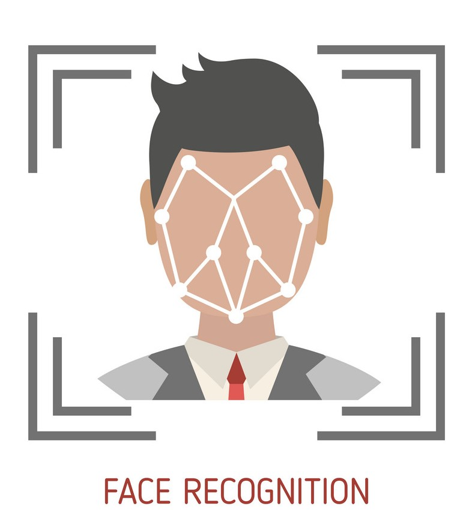

# 🎓 Face Recognition-Based Student Attendance System

This is a solo software development project created as part of the **CSE-2340: Software Development 1** course at **IIUC**. The system uses real-time face recognition to automate student attendance — a faster, smarter, and contactless alternative to manual methods.

---

## 📚 Course Info

- **University**: International Islamic University Chittagong (IIUC)
- **Course Name**: Software Development 1
- **Course Code**: CSE-2340
- **ISCED Code**: 0613
- **Developer**: Nazrana Nahreen

---

## 💡 Features

- 🔐 Secure login system
- 🧑‍🎓 Student registration with photo
- 📸 Real-time face detection and recognition
- 📝 Automatic attendance logging in `.csv`
- 📊 Attendance view panel
- 🗃️ Face data training and storage
- 🎨 Simple and user-friendly GUI using `Tkinter`

---

## 🛠️ Tech Stack

| Category        | Tools / Libraries            |
|----------------|-------------------------------|
| Language        | Python 3                      |
| GUI             | Tkinter                       |
| Face Detection  | OpenCV, Haar Cascades         |
| Face Recognition| `face_recognition` library    |
| Image Handling  | Pillow                        |
| File Storage    | CSV, Local Images             |

---

## 📸 Screenshots

| Login Panel | Face Scanning | Attendance CSV |
|-------------|----------------|----------------|
|  |  |  |

---

## 📁 Project Structure
.
├── main.py # Entry point
├── login.py # Login system
├── register.py # User registration
├── student.py # Student data
├── recognition.py # Face recognition logic
├── train.py # Training data
├── takeattendance.py # Attendance system
├── haarcascade_frontalface_default.xml # Face detection model
├── attendance.csv # Attendance log
├── *.jpg / *.png / *.avif # Images and icons
└── *.pyc # Compiled Python files

